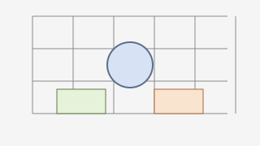

# Chapter 2 – Comparative tables

The following tables show how neutral datasets can be structured. All values are illustrative averages and can easily be replaced with real measurement series.

## 2.1 Overview table
| Measurement point | Week 1 | Week 2 | Week 3 | Week 4 |
|-----------|---------|---------|---------|---------|
| Mean temperature (°C) | 18.2 | 18.5 | 18.4 | 18.3 |
| Relative humidity (%) | 52 | 53 | 51 | 52 |
| Hours of daylight | 14 | 14 | 13 | 13 |

## 2.2 Format example for ratios
| Category | Share of total volume | Note |
|-----------|------------------------|-------|
| Measurements with direct sensor reference | 40% | Sensors calibrated to ISO 17025 |
| Derived reference values | 35% | Computed using moving averages |
| Context data | 25% | Sourced from public catalogues[^2] |

The tables can be exported as CSV or revisited in [Appendix A](../appendices/appendix-a.md#table-layout). Always link internal sections using relative paths so the book works offline.

## 2.3 Reference to figures

The figure illustrates how measurement zones can be shown schematically without naming real locations.

To verify an embedded HTML inlay variant, the following figure can additionally be used:

<figure><figcaption>
ERDA logo
</figcaption></figure>

[^2]: Cf. the referenced open catalogues in [Citations & further reading](../references.md).
